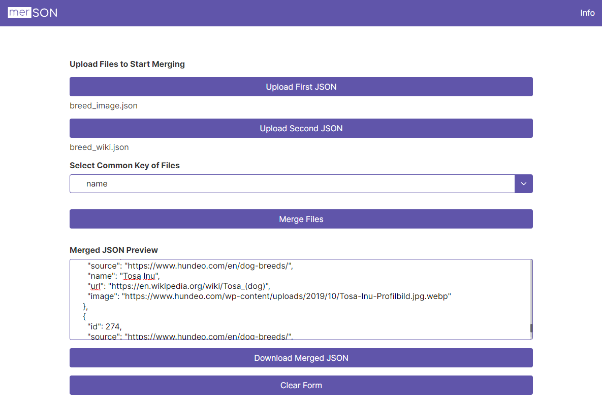

# merSON

(acronym for Merge JSON) Merge JSON Object Arrays via matching Object Key.

## What is it?

A tool that merges two JSON array files with a matching object key quickly with no fuss.

## How to use it?

Upload the two JSON files you need to merge and select the matching object key for both files. Click merge to preview the merged file and download it to export a JSON file.
